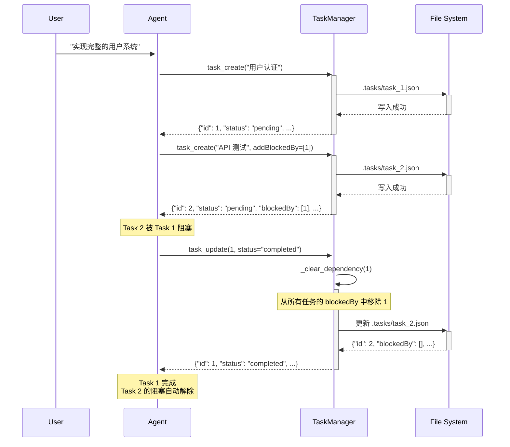

# S07 学习笔记：任务系统（Task System）

## 2026-05-05

### S01 - S07 演进总结

| Session | 主题 | 核心机制 |
|---------|------|----------|
| S01 | Agent 循环 | while + stop_reason |
| S02 | 工具分发 | TOOL_HANDLERS 映射 |
| S03 | 计划优先 | TodoManager + Nag Reminder |
| S04 | 子代理 | 独立 messages[] + 摘要返回 |
| S05 | 技能加载 | 两层注入：元数据 + 按需 |
| S06 | 上下文压缩 | 三层压缩实现无限会话 |
| **S07** | **任务系统** | **基于文件的持久化任务图** |

### 关键洞察

> **"State that survives compression -- because it's outside the conversation."**

任务状态存在于对话之外的文件系统中，因此即使上下文被压缩，任务也不会丢失。

### S07 核心创新：文件持久化任务

#### 为什么需要持久化任务？

- S03 的 TodoManager 存储在内存中，一旦对话结束就丢失
- S06 的上下文压缩会清空消息历史，但任务状态应该保留
- 需要一个跨会话的任务追踪系统

#### 解决方案：`.tasks/` 目录

```
.tasks/
├── task_1.json    # {"id": 1, "subject": "完成 A", "status": "completed", ...}
├── task_2.json    # {"id": 2, "blockedBy": [1], "status": "pending", ...}
└── task_3.json    # {"id": 3, "blockedBy": [2], "status": "pending", ...}
```

每个任务是一个独立的 JSON 文件，包含：

```json
{
  "id": 1,
  "subject": "实现用户认证",
  "description": "使用 JWT 实现登录注册",
  "status": "pending",
  "owner": "",
  "blockedBy": []
}
```

### 任务依赖图

#### 依赖关系的意义

```
+----------+     +----------+     +----------+
| task 1   | --> | task 2   | --> | task 3   |
| pending  |     | pending  |     | pending  |
+----------+     +----------+     +----------+
     |                ^
     +--- 完成后自动 ---+
```

- Task 2 被 Task 1 阻塞（`blockedBy: [1]`）
- Task 3 被 Task 2 阻塞（`blockedBy: [2]`）
- 完成 Task 1 后，自动从 Task 2 的 `blockedBy` 中移除

#### 依赖解除机制

当任务完成时，自动清除它对其他任务的阻塞：

```python
def _clear_dependency(self, completed_id: int):
    for f in self.dir.glob("task_*.json"):
        task = json.loads(f.read_text())
        if completed_id in task.get("blockedBy", []):
            task["blockedBy"].remove(completed_id)
            self._save(task)
```

### 任务状态流转

```
                    ┌─────────────┐
                    │   create   │
                    └──────┬──────┘
                           │
                           v
                    ┌─────────────┐
         ┌─────────│   pending   │─────────┐
         │         └─────────────┘         │
         │                                 │
         v                                 v
┌─────────────────┐              ┌─────────────────┐
│   in_progress   │              │    completed    │
│   (被认领后)     │              │                 │
└────────┬────────┘              └─────────────────┘
         │
         v
  ┌─────────────┐
  │   pending   │ (可重新放回 pending)
  └─────────────┘
```

### 核心代码解析

#### TaskManager 初始化

```python
class TaskManager:
    def __init__(self, tasks_dir: Path):
        self.dir = tasks_dir
        self.dir.mkdir(exist_ok=True)  # 自动创建目录
        self._next_id = self._max_id() + 1  # 下一个可用 ID
```

#### 创建任务

```python
def create(self, subject: str, description: str = "") -> str:
    task = {
        "id": self._next_id,
        "subject": subject,
        "description": description,
        "status": "pending",
        "blockedBy": [],    # 初始无依赖
        "owner": "",
    }
    self._save(task)
    self._next_id += 1
    return json.dumps(task, indent=2)
```

#### 更新任务

```python
def update(self, task_id: int, status: str = None,
           add_blocked_by: list = None, remove_blocked_by: list = None) -> str:
    task = self._load(task_id)

    if status:
        task["status"] = status
        if status == "completed":
            self._clear_dependency(task_id)  # 清除依赖

    if add_blocked_by:
        task["blockedBy"] = list(set(task["blockedBy"] + add_blocked_by))

    if remove_blocked_by:
        task["blockedBy"] = [x for x in task["blockedBy"] if x not in remove_blocked_by]

    self._save(task)
    return json.dumps(task, indent=2)
```

#### 列出所有任务

```python
def list_all(self) -> str:
    tasks = []
    for f in sorted(self.dir.glob("task_*.json")):
        tasks.append(json.loads(f.read_text()))

    lines = []
    for t in tasks:
        marker = {"pending": "[ ]", "in_progress": "[>]", "completed": "[x]"}.get(t["status"])
        blocked = f" (blocked by: {t['blockedBy']})" if t.get("blockedBy") else ""
        lines.append(f"{marker} #{t['id']}: {t['subject']}{blocked}")

    return "\n".join(lines)
```

### 工具定义

```python
TOOL_HANDLERS = {
    "bash":        ...,
    "read_file":   ...,
    "write_file":  ...,
    "edit_file":   ...,
    "task_create": lambda **kw: TASKS.create(kw["subject"], kw.get("description", "")),
    "task_update": lambda **kw: TASKS.update(kw["task_id"], kw.get("status"), ...),
    "task_list":   lambda **kw: TASKS.list_all(),
    "task_get":    lambda **kw: TASKS.get(kw["task_id"]),
}

TOOLS = [
    {"name": "task_create", "description": "Create a new task.",
     "input_schema": {"type": "object", "properties": {"subject": ..., "description": ...}}},
    {"name": "task_update", "description": "Update a task's status or dependencies.",
     "input_schema": {"type": "object", "properties": {
         "task_id": ..., "status": ..., "addBlockedBy": ..., "removeBlockedBy": ...}}},
    {"name": "task_list", "description": "List all tasks with status summary."},
    {"name": "task_get", "description": "Get full details of a task by ID."},
]
```

### 时序图

![[学习笔记_S07_任务系统 2026-05-31 19.22.28.excalidraw|832]]



### 文件清单

- `s07_task_system.py` - 任务系统实现
- `.tasks/` - 任务文件存储目录
  - `task_1.json`
  - `task_2.json`
  - …

### S07 vs S03 对比

| 特性 | S03 TodoManager | S07 TaskManager |
|------|-----------------|-----------------|
| 存储位置 | 内存 | 文件系统 |
| 持久化 | ❌ 对话结束丢失 | ✅ 跨会话保持 |
| 依赖关系 | ❌ 不支持 | ✅ blockedBy |
| 复杂状态 | 简单列表 | 完整任务对象 |
| 适用场景 | 单会话任务追踪 | 长期项目协作 |

### 与 S06 压缩的结合

S07 的任务系统特别适合与 S06 的上下文压缩配合使用：

1. **上下文压缩前**：创建任务记录工作进度
2. **压缩后**：任务状态保留在文件中
3. **恢复时**：从 `.tasks/` 读取任务状态，继续工作

```
压缩前：
  Agent 创建 task_1, task_2
  messages 中有 50k+ tokens

压缩后：
  messages = [summary]
  .tasks/task_1.json = {status: "completed"}
  .tasks/task_2.json = {status: "in_progress"}

恢复时：
  Agent 查询 task_list，发现 task_2 正在执行
  直接继续 task_2 的工作
```

### 核心模式

```
创建任务 → task_create(subject, description)
    ↓
认领任务 → task_update(task_id, status="in_progress", owner="agent")
    ↓
执行工作 → 使用其他工具（bash, read_file 等）
    ↓
完成任务 → task_update(task_id, status="completed")
    ↓
自动解除 → 其他任务的 blockedBy 自动移除该任务 ID
```

### Python 语法补充

#### `glob()` 文件匹配

```python
# 查找目录下所有 task_*.json 文件
for f in self.dir.glob("task_*.json"):
    print(f.stem)  # "task_1", "task_2", ...

# 按名称排序
for f in sorted(self.dir.glob("task_*.json")):
    ...
```

#### `f.stem` 获取文件名stem

```python
from pathlib import Path

p = Path("task_1.json")
p.stem    # "task_1"
p.suffix  # ".json"
p.name    # "task_1.json"
```

#### `missing_ok=True` 参数

```python
# Python 3.8+
path.unlink(missing_ok=True)  # 文件不存在不报错
path.unlink()                   # 文件不存在则 FileNotFoundError
```

#### `list(set(…))` 去重

```python
a = [1, 2, 2, 3, 3, 3]
list(set(a))  # [1, 2, 3]  去重但无序

# 有序去重
seen = set()
result = []
for x in a:
    if x not in seen:
        seen.add(x)
        result.append(x)
```

---

**下一步**：S08 - 后台任务（Background Tasks）