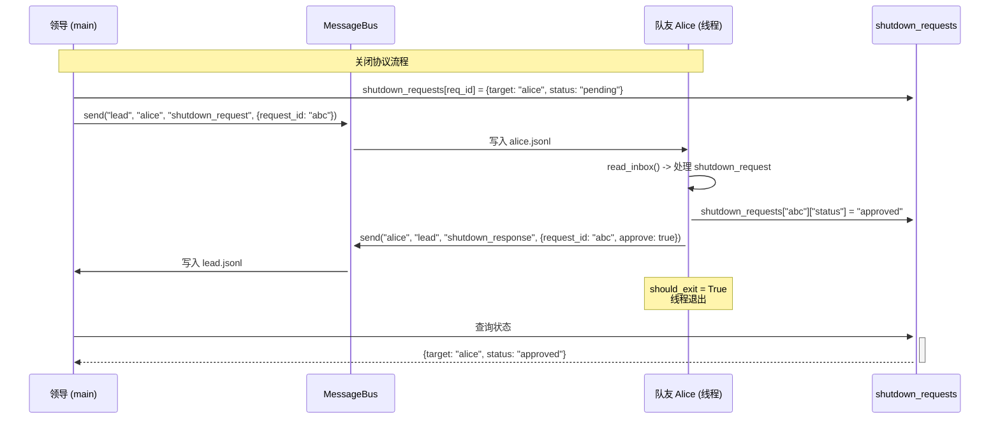

# S10 学习笔记：团队协议（Team Protocols）

## 2026-05-05

### S01 - S10 演进总结

| Session | 主题 | 核心机制 |
|---------|------|----------|
| S01 | Agent 循环 | while + stop_reason |
| S02 | 工具分发 | TOOL_HANDLERS 映射 |
| S03 | 计划优先 | TodoManager + Nag Reminder |
| S04 | 子代理 | 独立 messages[] + 摘要返回 |
| S05 | 技能加载 | 两层注入：元数据 + 按需 |
| S06 | 上下文压缩 | 三层压缩实现无限会话 |
| S07 | 任务系统 | 基于文件的持久化任务图 |
| S08 | 后台任务 | 线程执行 + 通知队列 |
| S09 | 代理团队 | 持久化队友 + JSONL 邮箱 |
| **S10** | **团队协议** | **关闭/批准 有限状态机** |

### 关键洞察

> **"Same request_id correlation pattern, two domains."**

关闭协议和计划审批协议使用相同的 request_id 关联模式，只是应用领域不同。

### S10 核心创新：协议有限状态机

#### S09 的问题

- S09 只有基本的发消息能力
- 缺乏对队友的**控制机制**
- 无法优雅关闭队友
- 无法审批队友的重要计划

#### S10 的解决方案

两种协议 FSM（有限状态机）：

1. **Shutdown FSM**：pending → approved | rejected
2. **Plan Approval FSM**：pending → approved | rejected

### 关闭协议（Shutdown Protocol）

#### 状态图

```
  Lead                           Teammate
    │                                │
    │  shutdown_request ────────────>│
    │  {request_id: "abc"}           │
    │                                │ (接收请求，决定)
    │                                │
    │         shutdown_response <───┤
    │         {                     │
    │           request_id: "abc",  │
    │           approve: true|false │
    │         }                      │
    │                                │
    ▼                                ▼
status -> "shutdown"            thread exits
```

#### 追踪器

```python
shutdown_requests = {}  # {request_id: {"target": name, "status": "pending|approved|rejected"}}
```

#### 实现

```python
def handle_shutdown_request(teammate: str) -> str:
    req_id = str(uuid.uuid4())[:8]
    with _tracker_lock:
        shutdown_requests[req_id] = {"target": teammate, "status": "pending"}
    BUS.send(
        "lead", teammate,
        "Please shut down gracefully.",
        "shutdown_request",
        {"request_id": req_id},
    )
    return f"Shutdown request {req_id} sent to '{teammate}'"

# 队友端
if tool_name == "shutdown_response":
    req_id = args["request_id"]
    approve = args["approve"]
    with _tracker_lock:
        if req_id in shutdown_requests:
            shutdown_requests[req_id]["status"] = "approved" if approve else "rejected"
    BUS.send(
        sender, "lead", args.get("reason", ""),
        "shutdown_response",
        {"request_id": req_id, "approve": approve},
    )
    return f"Shutdown {'approved' if approve else 'rejected'}"
```

### 计划审批协议（Plan Approval Protocol）

#### 状态图

```
  Teammate                        Lead
    │                                │
    │  plan_approval ───────────────>│
    │  {plan: "我将做..."}            │
    │                                │ (审查计划)
    │                                │ (approve/reject)
    │                                │
    │         plan_approval_resp <──┤
    │         {                      │
    │           request_id: "xyz",  │
    │           approve: true|false │
    │         }                      │
    ▼                                ▼
wait for response              status updated
```

#### 追踪器

```python
plan_requests = {}  # {request_id: {"from": name, "plan": "...", "status": "pending|approved|rejected"}}
```

#### 实现

```python
def handle_plan_review(request_id: str, approve: bool, feedback: str = "") -> str:
    with _tracker_lock:
        req = plan_requests.get(request_id)
    if not req:
        return f"Error: Unknown plan request_id '{request_id}'"
    with _tracker_lock:
        req["status"] = "approved" if approve else "rejected"
    BUS.send(
        "lead", req["from"], feedback,
        "plan_approval_response",
        {"request_id": request_id, "approve": approve, "feedback": feedback},
    )
    return f"Plan {req['status']} for '{req['from']}'"

# 队友端
if tool_name == "plan_approval":
    plan_text = args.get("plan", "")
    req_id = str(uuid.uuid4())[:8]
    with _tracker_lock:
        plan_requests[req_id] = {"from": sender, "plan": plan_text, "status": "pending"}
    BUS.send(
        sender, "lead", plan_text,
        "plan_approval_response",
        {"request_id": req_id, "plan": plan_text},
    )
    return f"Plan submitted (request_id={req_id}). Waiting for lead approval."
```

### 两种协议的对比

| 特性 | Shutdown Protocol | Plan Approval Protocol |
|------|-------------------|------------------------|
| 发起方 | Lead | Teammate |
| 请求方向 | Lead → Teammate | Teammate → Lead |
| 响应方向 | Teammate → Lead | Lead → Teammate |
| request_id 生成 | Lead | Teammate |
| 追踪器 | shutdown_requests | plan_requests |

### 协议工具定义

```python
TOOL_HANDLERS = {
    # ... 基础工具 ...
    "shutdown_request":  lambda **kw: handle_shutdown_request(kw["teammate"]),
    "shutdown_response": lambda **kw: _check_shutdown_status(kw.get("request_id", "")),
    "plan_approval":     lambda **kw: handle_plan_review(kw["request_id"], kw["approve"], kw.get("feedback", "")),
}

TOOLS = [
    # ...
    {"name": "shutdown_request", "description": "Request a teammate to shut down gracefully.",
     "input_schema": {"type": "object", "properties": {"teammate": {"type": "string"}}, "required": ["teammate"]}},
    {"name": "shutdown_response", "description": "Check the status of a shutdown request.",
     "input_schema": {"type": "object", "properties": {"request_id": {"type": "string"}}, "required": ["request_id"]}},
    {"name": "plan_approval", "description": "Approve or reject a teammate's plan.",
     "input_schema": {"type": "object", "properties": {
         "request_id": {"type": "string"},
         "approve": {"type": "boolean"},
         "feedback": {"type": "string"}
     }, "required": ["request_id", "approve"]}},
]
```

### 队友工具集

```python
def _teammate_tools(self):
    return [
        {"name": "bash", ...},
        {"name": "read_file", ...},
        {"name": "write_file", ...},
        {"name": "edit_file", ...},
        {"name": "send_message", ...},
        {"name": "read_inbox", ...},
        {"name": "shutdown_response", ...},  # 新增
        {"name": "plan_approval", ...},      # 新增
    ]
```

### 队友的系统提示词

```python
sys_prompt = (
    f"You are '{name}', role: {role}, at {WORKDIR}. "
    f"Submit plans via plan_approval before major work. "  # 要求提交计划
    f"Respond to shutdown_request with shutdown_response."  # 要求响应关闭
)
```

### 线程退出条件

```python
def _teammate_loop(self, name, role, prompt):
    while True:
        # ... 处理消息 ...
        for block in response.content:
            if block.type == "tool_use":
                # ...
                if block.name == "shutdown_response" and block.input.get("approve"):
                    should_exit = True
        if should_exit:
            break
```

### 完整的工作流程

```
领导创建队友：
  spawn_teammate("alice", "coder", "实现功能 X")

队友工作流程：
  1. 读取收件箱
  2. LLM 调用
  3. 重要工作前调用 plan_approval 提交计划
  4. 等待领导批准
  5. 执行工作

领导工作流程：
  1. 检查收件箱
  2. 收到 plan_approval，使用 plan_approval 批准/拒绝
  3. 需要关闭时，发送 shutdown_request
  4. 收到 shutdown_response，确认关闭

队友收到关闭：
  1. 读取 shutdown_request
  2. 调用 shutdown_response(approve=True)
  3. 线程退出
```

### 核心模式

```
通用 request_id 模式：
  1. 发起方生成 request_id
  2. 写入追踪器（带状态 "pending"）
  3. 发送带 request_id 的消息
  4. 响应方携带 request_id 回复
  5. 发起方更新追踪器状态
```

### 时序图：关闭协议



### 时序图：计划审批协议

```mermaid
sequenceDiagram
    participant Lead as 领导 (main)
    participant BUS as MessageBus
    participant Alice as 队友 Alice (线程)
    participant Tracker as plan_requests

    Note over Lead,Alice: 计划审批协议流程

    Alice->>+Tracker: plan_requests[req_id] = {from: "alice", plan: "...", status: "pending"}
    Alice->>+BUS: send("alice", "lead", "plan_approval", {request_id: "xyz", plan: "我将..."})
    BUS->>Lead: 写入 lead.jsonl

    Lead->>+Lead: 审查计划
    Lead->>+Tracker: plan_requests["xyz"]["status"] = "approved"
    Lead->>+BUS: send("lead", "alice", "plan_approval_response", {request_id: "xyz", approve: true})
    BUS->>Alice: 写入 alice.jsonl

    Alice->>+Alice: 收到审批结果<br/>开始执行计划

---

**下一步**：S11 - 自主代理（Autonomous Agents）