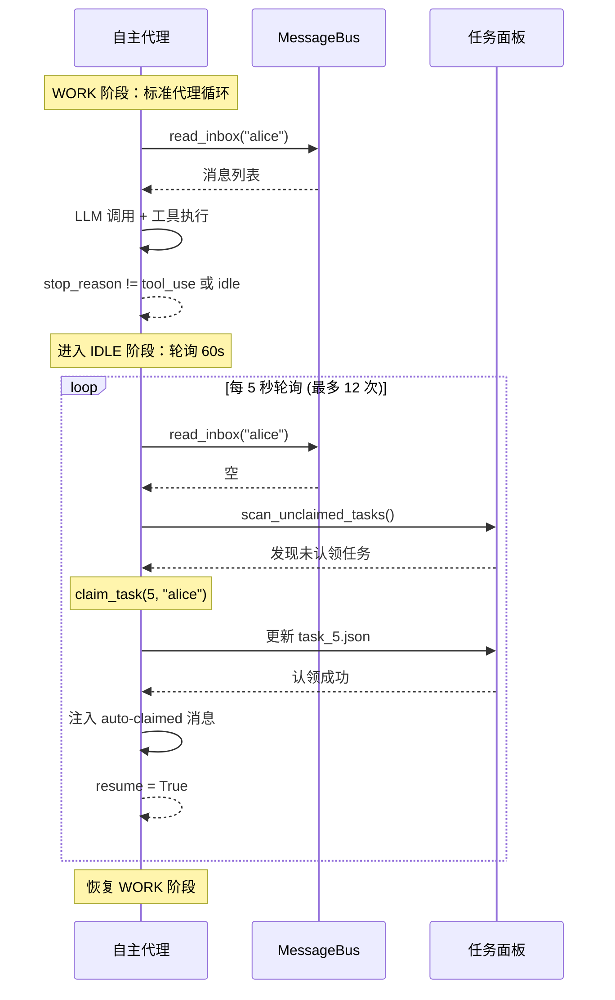
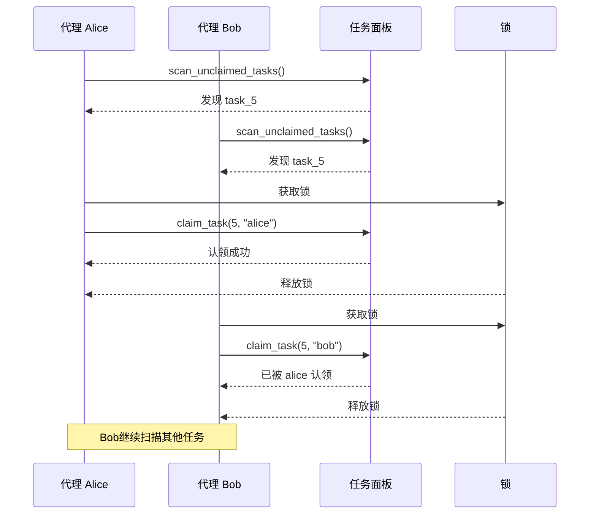

# S11 学习笔记：自主代理（Autonomous Agents）

## 2026-05-05

### S01 - S11 演进总结

| Session | 主题 | 核心机制 |
|---------|------|----------|
| S01 | Agent 循环 | while + stop_reason |
| S02 | 工具分发 | TOOL_HANDLERS 映射 |
| S03 | 计划优先 | TodoManager + Nag Reminder |
| S04 | 子代理 | 独立 messages[] + 摘要返回 |
| S05 | 技能加载 | 两层注入：元数据 + 按需 |
| S06 | 上下文压缩 | 三层压缩实现无限会话 |
| S07 | 任务系统 | 基于文件的持久化任务图 |
| S08 | 后台任务 | 线程执行 + 通知队列 |
| S09 | 代理团队 | 持久化队友 + JSONL 邮箱 |
| S10 | 团队协议 | 关闭/批准 有限状态机 |
| **S11** | **自主代理** | **空闲扫描 + 自动认领** |

### 关键洞察

> **"The agent finds work itself."**

代理不再被动等待领导分配任务，而是主动扫描任务面板，发现未认领的任务时自动认领并开始工作。

### S11 核心创新：自主工作循环

#### S10 的问题

- 队友被动等待消息
- 没有消息时就空闲（idle）
- 需要领导主动分配任务

#### S11 的解决方案

在空闲阶段增加**轮询机制**：

1. 轮询收件箱 → 有消息则恢复工作
2. 轮询任务面板 → 发现未认领任务则自动认领
3. 超时则优雅关闭

### 代理生命周期

```
    +-------+
    | spawn |
    +---+---+
        |
        v
    +-------+  tool_use    +-------+
    | WORK  | <----------- |  LLM  |
    +---+---+              +-------+
        |
        | stop_reason != tool_use
        v
    +--------+
    | IDLE   | poll every 5s for up to 60s
    +---+----+
        |
        +---> check inbox -> message? -> resume WORK
        |
        +---> scan .tasks/ -> unclaimed? -> claim -> resume WORK
        |
        +---> timeout (60s) -> shutdown
```

### 两阶段循环

#### 工作阶段（WORK PHASE）

```python
# 标准代理循环，最多 50 轮
for _ in range(50):
    inbox = BUS.read_inbox(name)
    for msg in inbox:
        if msg.get("type") == "shutdown_request":
            self._set_status(name, "shutdown")
            return
        messages.append({"role": "user", "content": json.dumps(msg)})

    response = client.messages.create(model=MODEL, system=sys_prompt, messages=messages, tools=tools)
    messages.append({"role": "assistant", "content": response.content})

    if response.stop_reason != "tool_use":
        break  # 对话结束，进入空闲阶段

    # 工具执行
    results = []
    idle_requested = False
    for block in response.content:
        if block.type == "tool_use":
            if block.name == "idle":
                idle_requested = True
                output = "Entering idle phase."
            else:
                output = self._exec(name, block.name, block.input)
            results.append({...})
    messages.append({"role": "user", "content": results})

    if idle_requested:
        break  # 主动请求空闲，进入空闲阶段
```

#### 空闲阶段（IDLE PHASE）

```python
self._set_status(name, "idle")
resume = False
polls = IDLE_TIMEOUT // POLL_INTERVAL  # 60s / 5s = 12 次轮询

for _ in range(polls):
    time.sleep(POLL_INTERVAL)  # 等待 5 秒

    # 1. 检查收件箱
    inbox = BUS.read_inbox(name)
    if inbox:
        for msg in inbox:
            if msg.get("type") == "shutdown_request":
                self._set_status(name, "shutdown")
                return
            messages.append({"role": "user", "content": json.dumps(msg)})
        resume = True
        break

    # 2. 扫描未认领任务
    unclaimed = scan_unclaimed_tasks()
    if unclaimed:
        task = unclaimed[0]
        result = claim_task(task["id"], name)
        if not result.startswith("Error:"):
            # 注入任务信息
            task_prompt = f"<auto-claimed>Task #{task['id']}: {task['subject']}\n{task.get('description', '')}</auto-claimed>"
            messages.append({"role": "user", "content": task_prompt})
            resume = True
            break

# 如果 60 秒内没有任何事发生，关闭
if not resume:
    self._set_status(name, "shutdown")
    return

self._set_status(name, "working")
```

### 任务扫描与认领

```python
def scan_unclaimed_tasks() -> list:
    """扫描未认领且无依赖的待处理任务"""
    TASKS_DIR.mkdir(exist_ok=True)
    unclaimed = []
    for f in sorted(TASKS_DIR.glob("task_*.json")):
        task = json.loads(f.read_text())
        if (task.get("status") == "pending"
                and not task.get("owner")
                and not task.get("blockedBy")):
            unclaimed.append(task)
    return unclaimed

def claim_task(task_id: int, owner: str) -> str:
    """原子性地认领任务"""
    with _claim_lock:
        path = TASKS_DIR / f"task_{task_id}.json"
        task = json.loads(path.read_text())
        if task.get("owner"):
            return f"Error: Task {task_id} has already been claimed"
        if task.get("blockedBy"):
            return f"Error: Task {task_id} is blocked"
        task["owner"] = owner
        task["status"] = "in_progress"
        path.write_text(json.dumps(task, indent=2))
    return f"Claimed task #{task_id} for {owner}"
```

### 身份重注入（Identity Re-injection）

当上下文压缩后，代理可能丢失身份信息。S11 通过身份块恢复：

```python
def make_identity_block(name: str, role: str, team_name: str) -> dict:
    return {
        "role": "user",
        "content": f"<identity>You are '{name}', role: {role}, team: {team_name}. Continue your work.</identity>",
    }

# 在自动认领任务时，如果消息很少（可能被压缩过）
if len(messages) <= 3:
    messages.insert(0, make_identity_block(name, role, team_name))
    messages.insert(1, {"role": "assistant", "content": f"I am {name}. Continuing."})
```

### idle 工具

队友新增 `idle` 工具，主动请求进入空闲阶段：

```python
{"name": "idle", "description": "Signal that you have no more work. Enters idle polling phase.",
 "input_schema": {"type": "object", "properties": {}}}
```

领导端直接返回 `"Lead does not idle."`，因为领导不需要空闲。

### claim_task 工具

新增让代理主动认领任务的工具：

```python
{"name": "claim_task", "description": "Claim a task from the task board by ID.",
 "input_schema": {"type": "object", "properties": {"task_id": {"type": "integer"}}, "required": ["task_id"]}}
```

### 配置常量

```python
POLL_INTERVAL = 5   # 每 5 秒轮询一次
IDLE_TIMEOUT = 60  # 空闲超时 60 秒
```

### 状态流转

```
spawn
  │
  v
working ─────────────────────────────────┐
  │                                     │
  │ (收到 shutdown_request)            │ (idle tool 调用 或 对话结束)
  │                                     │
  v                                     v
shutdown                           idle (轮询)
  │                                     │
  │                              ┌──────┴──────┐
  │                              │             │
  │                              v             v
  │                         收到消息       扫描到任务
  │                              │             │
  │                              v             v
  │                         resume          claim
  │                          =True          =True
  │                              │             │
  │                              └──────┬──────┘
  │                                     │
  │                                     v
  └─────────────────────────────────────┘
                              working (继续)

                              或

  idle 60s 无事发生 ──> shutdown
```

### 与 S03 的区别

| 特性 | S03 TodoWrite | S11 自主代理 |
|------|---------------|-------------|
| 任务来源 | 领导分配 | 代理主动扫描 |
| 空闲机制 | 无 | 轮询收件箱和任务面板 |
| 状态保持 | 无 | 有（文件持久化） |
| 适用场景 | 单代理 | 多代理协作 |

### 核心模式

```
代理主循环：
  工作阶段：
    读取收件箱
    LLM 调用
    工具执行（可能调用 idle）
    ↓
  空闲阶段：
    等待 5 秒
    检查收件箱 → 有消息？恢复工作
    扫描任务面板 → 有未认领任务？自动认领并恢复工作
    超时 → 关闭
```

### 使用场景

1. **持续监控任务队列**：代理定期检查新任务
2. **事件驱动响应**：收到消息时立即唤醒
3. **资源高效利用**：无事发生时降低资源消耗
4. **分布式任务处理**：多个代理竞争或分工任务

### 时序图：自主代理生命周期



### 时序图：多代理竞争任务



---

**下一步**：S12 - 工作树隔离（Worktree Isolation）